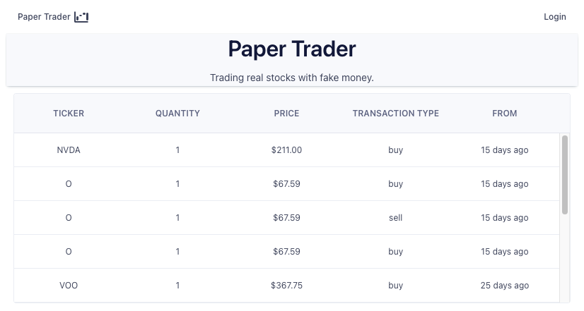
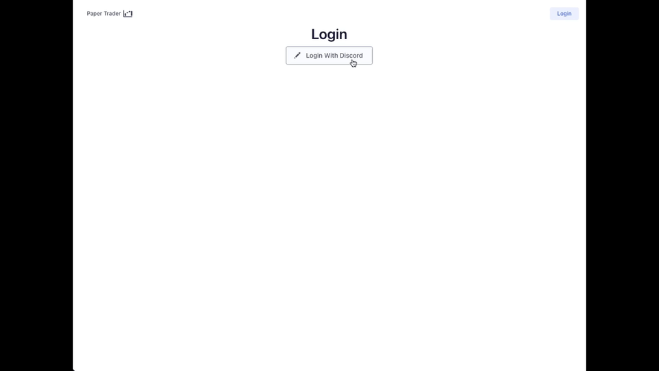
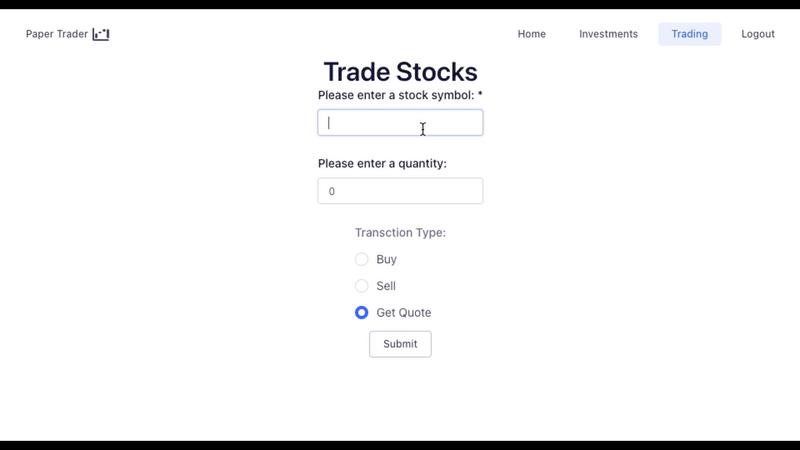
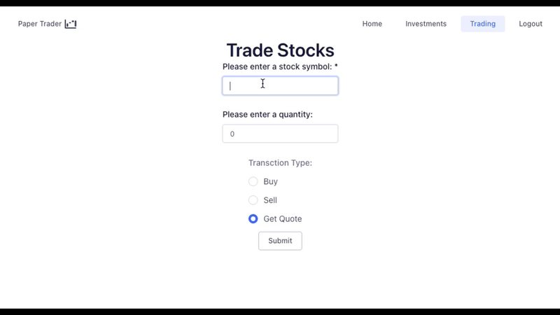
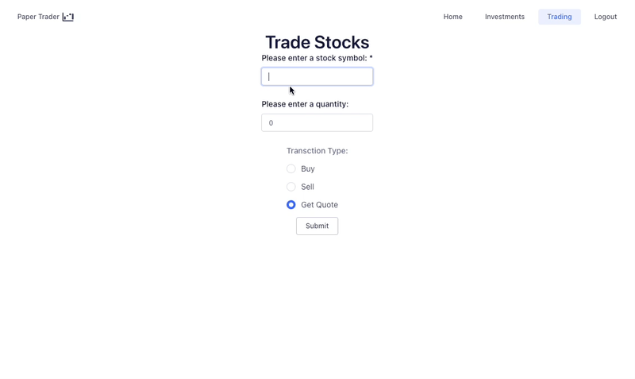
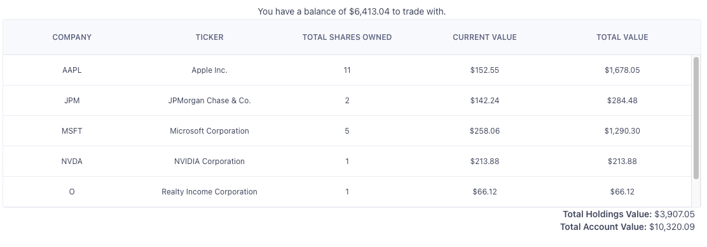

<!-- Improved compatibility of back to top link: See: https://github.com/othneildrew/Best-README-Template/pull/73 -->

<a name="readme-top"></a>

<!--
*** Thanks for checking out the Best-README-Template. If you have a suggestion
*** that would make this better, please fork the repo and create a pull request
*** or simply open an issue with the tag "enhancement".
*** Don't forget to give the project a star!
*** Thanks again! Now go create something AMAZING! :D
-->

<!-- PROJECT SHIELDS -->
<!--
*** I'm using markdown "reference style" links for readability.
*** Reference links are enclosed in brackets [ ] instead of parentheses ( ).
*** See the bottom of this document for the declaration of the reference variables
*** for contributors-url, forks-url, etc. This is an optional, concise syntax you may use.
*** https://www.markdownguide.org/basic-syntax/#reference-style-links
-->

<!-- PROJECT LOGO -->
<br />
<div align="center">


<h3 align="center">Paper Trader</h3>

  <p align="center">
    A mock stock trading app, trading real stocks with fake money!
    <br />
    <a href="https://github.com/still-pursuing/paper-trader"><strong>Explore the docs »</strong></a>
    <br />
    <br />
    <a href="https://paper-trader-182a4.web.app/">View Demo</a>
    ·
    <a href="https://github.com/still-pursuing/paper-trader/issues">Report Bug</a>
    ·
    <a href="https://github.com/still-pursuing/paper-trader/issues">Request Feature</a>
  </p>
</div>

<!-- TABLE OF CONTENTS -->
<details>
  <summary>Table of Contents</summary>
  <ol>
    <li>
      <a href="#about-the-project">About The Project</a>
      <ul>
        <li><a href="#built-with">Built With</a></li>
      </ul>
    </li>
    <li>
      <a href="#getting-started">Getting Started</a>
      <ul>
        <li><a href="#prerequisites">Prerequisites</a></li>
        <li><a href="#installation">Installation</a></li>
      </ul>
    </li>
    <li><a href="#usage">Usage</a></li>
    <li><a href="#roadmap">Roadmap</a></li>
    <li><a href="#contributing">Contributing</a></li>
    <li><a href="#license">License</a></li>
    <li><a href="#contact">Contact</a></li>
    <li><a href="#acknowledgments">Acknowledgments</a></li>
  </ol>
</details>

<!-- ABOUT THE PROJECT -->

## About The Project

<p align="center"></p>

The motivation for this project was to expose myself to different technologies that are popular in the software development industry.

### Implementation Decisions

1. Picking the stack

   - The main technologies used in this project were Typescript, React, Node and Express. As I wanted to use new technologies that are popular in the software development industry, but also wanted to continue building my existing code language skills, I opted to use Typescript as the only new primary technology. Not only is it popular in the industry, but given it's type enforcing I believed it would be able to save me on debugging time down the road as errors would be caught during compilation. However, I did encounter a slight learning curve as I haven't worked with a typed language before, so utilizing React, Node, and Express ensured consistent progress.

2. Which deployment service to use

   - Oh the many free deployment services that exist, I opted to use Firebase and Fly.io. Firebase was chosen as it has a large range of services, and while Paper Trader doesn't utilize all of them, I wanted to get some familiarity to the platform as I hope to return to it in future projects. As for choosing Fly.io, I originally wanted to use Heroku as I used it in the past and was familiar with their deployment process. Unfortunately, Heroku ended their free hobby tier service and I needed to pick alternatives. In the end, I was deciding between Fly.io and Render, but given that I knew I wanted to use a PostgreSQL database, Render would not have worked as the platform [deletes their free database instance after 90 days](https://render.com/docs/free#free-postgresql-databases) regardless of activity at the time of writing this. Lastly, both platforms had clear documentation on how to setup a CI/CD pipeline with Github Actions, which I knew I wanted to implement for this project.

3. Setting up a CI/CD pipeline

   - I've experienced making changes and either forgetting to redeploy or deploying before saving the files. By learning to add this to this repository, gone are the days of showing a project and realizing the wrong version is in production (hopefully).

4. OAuth for user authentication and authorization

   - Across the internet I saw a lot of websites that I used offered SSO via other big platform services (e.g. Google, LinkedIn, etc.), I saw this would app would be a good opportunity to try integrating a similar process. Discord was choosen as the idea for Paper Trader formed while chatting with my friends over Discord. In addition to SSO being a popular user authentication process, it has the added benefit of relieving the pressure of making a robust user account system on my own. Account security is a very difficult infrastructure to get right, so relying on proven existing procedures was an easy choice.

5. Styling: CSS, Bootstrap, or a React Component Library?

   - I chose to go with a React Component Library (specifically Evergreen UI) as it has the benefits Bootstrap/Other CSS frameworks that provide consistent styling on the frontend and enable fine tuning with CSS if needed. Furthermore, I could spend less time on styling common React components such as a navbar and a form.

6. SQL vs NoSQL
   - Given that this application works with financial transactions, a relational database is better suited for the type of data that is being stored. Specifically, this application can benefit from the ACID compliance of a relational database, ensuring accurate transaction integrity.

### Challenges

Below is an ongoing compilation of the challenges encountered while working on this project. Some are general and some are specific.

- Learning to work with types
  - Given this was my first attempt at working with a typed language, I encountered some growing pains as features were added to the project. Originally it wasn't so bad when working with basic data types, like `number` and `string`, but that changed once I started having nested objects being passed around to my React components. Determining the correct structure for the interfaces and correct typing for the component props led to long sessions of reading StackOverflow, Typescript documentation, and various blog posts to figure out how to resolve my type errors.
- Deployment issues
  - Setting up a CI/CD pipeline with new deployment services was a bumpy experience getting started. From figuring out what the different errors meant from each deployment failure and understanding how to manipulate the target directories, each step helped refine my CI/CD setup. Barring updates to the services I use that will break my setup, I'm glad to have resolved the issues I had with getting this process implemented as it made deployment a seamless procedure.
- Implementing Discord OAuth
  - While getting started with using Discord's OAuth flow, I jumped into picking out pieces of the documentation to add onto the application. Unfortunately, this meant confusing bugs where I had no idea on how to even resolve. I decided to step back and make a dummy repo that followed Discord's documentation on getting a basic OAuth flow setup on a simple application. By breaking down each step of the process and tinkering with the example application, I was able to figure out why my haphazard OAuth integration had issues. Specifically, I wasn't properly generating the OAuth token and utilizing it in different application routes during my first attempt.
- Navigating through new technologies
  - A general catch-all challenge, but working with these new technologies (CI/CD, Typescript, Fly.io, OAuth, etc.) meant lots of opportunities for roadblocks. To overcome these challenges, I often had to spend more time reading and researching than actually coding up the feature/implementation.
- Getting feedback
  - Of course, what good would this project be as a learning tool if there was no feedback or review of the code. This led to searching up examples of how others may have implemented a similar feature, and reaching out to my more experienced software engineering friends for code reviews.

<p align="right">(<a href="#readme-top">back to top</a>)</p>

### Built With

- [![Typescript][typescript]][typescript-url]
- [![React][react.js]][react-url]
- [![Firebase][firebase]][firebase-url]
- [![Discord][discord]][discord-url]
- [![Express][express]][express-url]
- [![PostgreSQL][postgresql]][postgresql-url]
- [![Node][node.js]][node-url]
- [![Github Actions][github-actions]][github-actions-url]
- [Fly.io](https://fly.io/)
- [Evergreen UI](https://evergreen.segment.com/)
- [Luxon](https://moment.github.io/luxon/#/?id=luxon)
- [Axios](https://axios-http.com/)

<p align="right">(<a href="#readme-top">back to top</a>)</p>

<!-- GETTING STARTED -->

## Getting Started

To get a local copy up and running follow these simple example steps.

### Prerequisites

- Development Environment Setup

  - You can skip these steps below if you don't plan on submitting changes or features to the repository

  ```sh
  brew install pre-commit
  pre-commit install
  ```

  - Also need to install the [Prettier VS Code extension](https://marketplace.visualstudio.com/items?itemName=esbenp.prettier-vscode).

- npm
  - In both the `app/` directory and the `server/` directory, install the required npm packages:
  ```sh
  npm install
  ```

### Installation

This application utilizes a Discord Bot to process the OAuth2.0 login requests which has private keys that cannot be shared. If one wants to replicate this in their copy of this repository, one can start [here](https://discordjs.guide/oauth2/#a-quick-example).

1. Get a free Finnhub API Key at [https://finnhub.io/register](https://finnhub.io/register) and your Discord secrets from following their documentation previously linked.
2. Clone the repo
   ```sh
   git clone https://github.com/still-pursuing/paper-trader.git
   ```
3. Install NPM packages (this needs to be done in both the `app/` and `server/` directories as they have their own corresponding `package.json`)
   ```sh
   npm install
   ```
4. Enter your secrets in a `.env` file

   ```env
   CLIENT_SECRET=YOUR_CLIENT_SECRET_FROM_DISCORD
   CLIENT_ID=YOUR_CLIENT_ID_FROM_DISCORD
   FINNHUB_API_TOKEN=YOUR_API_KEY
   ```

5. Starting the application (similar to installing the NPM packages, this needs to be ran separately in both `app/` and `server/` directories)

   ```sh
    npm run start
   ```

<p align="right">(<a href="#readme-top">back to top</a>)</p>

<!-- USAGE EXAMPLES -->

## Usage

### Logging In

<p align="center"></p>

To get started with trading on **Paper Trader**, the user logins and authorizes the application to utilize their Discord profile via Discord's OAuth 2.0 implementation (Note, if the application was not previously authorized then the user will have an additional step of logging into their Discord account). Once authenticated, the user is redirected to their user profile page, displaying their account balance and investments (if any) queried from the PostgreSQL database. In addition, a JWT is generated and stored in the client's local storage such that the user's session can be maintained between visits without having to constantly reauthorize access to their Discord account if they have not logged out.

- Learnings of interest:
  - Integrating Discord OAuth authentication flow
  - Implementing unique error handling based on which part of the OAuth flow failed

### Making Transactions

<p align="center">


</p>

By filling out a form, a user can either buy, sell, or lookup a valid stock. However, if they have insufficient funds to make a purchase, try to sell more shares than they own, or enter an invalid stock, the transaction request will not be completed and an error message will be displayed.

<p align="center">

</p>

- Learnings of interest:
  - Utilized conditional statments in SQL query to check user's owned share quantities

### Investments

<p align="center">

</p>
Currently, the investments page displays the user's investment values. By making an aggregate API call to the unofficial Yahoo Finance API, the current value of each stock is found and the corresponding total value for the number of shares owned is calculated.
 
 - Learnings of interest:
    - Utilized Javascript's `.toLocale()` method to style the strings as currency
    - Reduced the number of individual API calls to Yahoo Finance by using their `quoteCombine` method
    - Refactored table component to be reusable, leading to more complex Typescript interfaces

<p align="right">(<a href="#readme-top">back to top</a>)</p>

<!-- ROADMAP -->

## Roadmap

<details>
<summary> Completed Features </summary>

- [x] Start a CI/CD Pipeline
  - [x] Utilize Github Actions to deploy on main branch merge to Firebase
  - [x] Utilize Github Actions to deploy on main branch merge to Fly.io
- [x] Create basic structure for frontend
  - [x] Add a navbar
  - [x] Start structure for pages (splash, profile, login, not found, etc.)
- [x] Create a User Account system
  - [x] Create login feature
  - [x] Integrate Discord OAuth
  - [x] Maintain user sessions
  - [x] Create logout feature
- [x] Add ability to purchase stocks based on NYSE
  - [x] Pick a Stock API (Finnhub)
  - [x] Add a form for user to make transaction requests
  - [x] Add routes for corresponding form requests
- [x] Display transaction details after successful requests
  - [x] Add a redirect page from transaction form
  - [x] Display transaction details
- [x] Display summary of recent transaction activity
  - [x] Show transaction information in a table on home page
- [x] Display a user's investments and their current portfolio value

  - [x] Utilize another Stock API with a greater rate limit (Unofficial Yahoo Finance API)
  - [x] Calculate total value and current owned shares of investments for a user
  - [x] Display investments in a table and the user's portfolio's total value

</details>

<details>
<summary>Features To Implement</summary>

- [ ] Add a table for user's recent activity
- [ ] Add tests
- [ ] Add a column for a share's average cost basis
- [ ] Add a Gain/Loss calculation
- [ ] Add a chart showing portfolio value trend
- [ ] Limit trading times based on market open/close times
</details>

See the [open issues](https://github.com/github_username/repo_name/issues) for a full list of proposed features (and known issues).

<p align="right">(<a href="#readme-top">back to top</a>)</p>

<!-- CONTRIBUTING -->

## Contributing

If you have a suggestion that would make this better, please fork the repo and create a pull request. You can also simply open an issue with the tag "enhancement".
Don't forget to give the repository a star! Thanks again!

1. Fork the repository
2. Create your Feature Branch (`git checkout -b feature/AmazingFeature`)
3. Commit your Changes (`git commit -m 'Add some AmazingFeature'`)
4. Push to the Branch (`git push origin feature/AmazingFeature`)
5. Open a Pull Request

<p align="right">(<a href="#readme-top">back to top</a>)</p>

<!-- CONTACT -->

## Contact

Project Link: [https://github.com/still-pursuing/paper-trader](https://github.com/still-pursuing/paper-trader)

<p align="right">(<a href="#readme-top">back to top</a>)</p>

<!-- ACKNOWLEDGMENTS -->

## Acknowledgments

- Thanks to [li-andy](https://github.com/li-andy) for taking the time to review pull requests for best practices and feedback on implementation

<p align="right">(<a href="#readme-top">back to top</a>)</p>

<!-- MARKDOWN LINKS & IMAGES -->
<!-- https://www.markdownguide.org/basic-syntax/#reference-style-links -->

[product-screenshot]: images/screenshot.png
[typescript]: https://img.shields.io/badge/typescript-%23007ACC.svg?style=for-the-badge&logo=typescript&logoColor=white
[typescript-url]: https://nextjs.org/
[react.js]: https://img.shields.io/badge/React-20232A?style=for-the-badge&logo=react&logoColor=61DAFB
[react-url]: https://reactjs.org/
[node.js]: https://img.shields.io/badge/node.js-6DA55F?style=for-the-badge&logo=node.js&logoColor=white
[node-url]: https://nodejs.org/en/
[discord]: https://img.shields.io/badge/Discord-%235865F2.svg?style=for-the-badge&logo=discord&logoColor=white
[discord-url]: https://discord.com/
[postgresql]: https://img.shields.io/badge/postgres-%23316192.svg?style=for-the-badge&logo=postgresql&logoColor=white
[postgresql-url]: https://www.postgresql.org/
[firebase]: https://img.shields.io/badge/firebase-%23039BE5.svg?style=for-the-badge&logo=firebase
[firebase-url]: https://firebase.google.com/
[express]: https://img.shields.io/badge/express.js-%23404d59.svg?style=for-the-badge&logo=express&logoColor=%2361DAFB
[express-url]: https://expressjs.com/
[github-actions]: https://img.shields.io/badge/github%20actions-%232671E5.svg?style=for-the-badge&logo=githubactions&logoColor=white
[github-actions-url]: https://docs.github.com/en/actions
