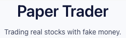

<!-- Improved compatibility of back to top link: See: https://github.com/othneildrew/Best-README-Template/pull/73 -->

<a name="readme-top"></a>

<!--
*** Thanks for checking out the Best-README-Template. If you have a suggestion
*** that would make this better, please fork the repo and create a pull request
*** or simply open an issue with the tag "enhancement".
*** Don't forget to give the project a star!
*** Thanks again! Now go create something AMAZING! :D
-->

<!-- PROJECT SHIELDS -->
<!--
*** I'm using markdown "reference style" links for readability.
*** Reference links are enclosed in brackets [ ] instead of parentheses ( ).
*** See the bottom of this document for the declaration of the reference variables
*** for contributors-url, forks-url, etc. This is an optional, concise syntax you may use.
*** https://www.markdownguide.org/basic-syntax/#reference-style-links
-->

<!-- PROJECT LOGO -->
<br />
<div align="center">
  <a href="https://github.com/github_username/repo_name">
    
  </a>

<h3 align="center">Paper Trader</h3>

  <p align="center">
    A mock stock trading app, trading real stocks with fake money!
    <br />
    <a href="https://github.com/github_username/repo_name"><strong>Explore the docs »</strong></a>
    <br />
    <br />
    <a href="https://paper-trader-182a4.web.app/">View Demo</a>
    ·
    <a href="https://github.com/still-pursuing/paper-trader/issues">Report Bug</a>
    ·
    <a href="https://github.com/still-pursuing/paper-trader/issues">Request Feature</a>
  </p>
</div>

<!-- TABLE OF CONTENTS -->
<details>
  <summary>Table of Contents</summary>
  <ol>
    <li>
      <a href="#about-the-project">About The Project</a>
      <ul>
        <li><a href="#built-with">Built With</a></li>
      </ul>
    </li>
    <li>
      <a href="#getting-started">Getting Started</a>
      <ul>
        <li><a href="#prerequisites">Prerequisites</a></li>
        <li><a href="#installation">Installation</a></li>
      </ul>
    </li>
    <li><a href="#usage">Usage</a></li>
    <li><a href="#roadmap">Roadmap</a></li>
    <li><a href="#contributing">Contributing</a></li>
    <li><a href="#license">License</a></li>
    <li><a href="#contact">Contact</a></li>
    <li><a href="#acknowledgments">Acknowledgments</a></li>
  </ol>
</details>

<!-- ABOUT THE PROJECT -->

## About The Project

[![Product Name Screen Shot][product-screenshot]](https://example.com)

The motivation for this project was to expose myself to different technologies that are popular in the software development industry.

- Implementation Decisions
- Challenges

<p align="right">(<a href="#readme-top">back to top</a>)</p>

### Built With

- [![Typescript][typescript]][typescript-url]
- [![React][react.js]][react-url]
- [![Firebase][firebase]][firebase-url]
- [![Discord][discord]][discord-url]
- [![Express][express]][express-url]
- [![PostgreSQL][postgresql]][postgresql-url]
- [![Node][node.js]][node-url]
- [![Github Actions][github-actions]][github-actions-url]
- [Fly.io](https://fly.io/)
- [Evergreen UI](https://evergreen.segment.com/)

<p align="right">(<a href="#readme-top">back to top</a>)</p>

<!-- GETTING STARTED -->

## Getting Started

To get a local copy up and running follow these simple example steps.

### Prerequisites

This is an example of how to list things you need to use the software and how to install them.

- Development Environment Setup

  - You can skip these steps below if you don't plan on submitting changes or features to the repository

  ```sh
  brew install pre-commit
  pre-commit install
  ```

  - Also need to install the [Prettier VS Code extension](https://marketplace.visualstudio.com/items?itemName=esbenp.prettier-vscode).

- npm
  - In both the `app/` directory and the `server/` directory, install the required npm packages:
  ```sh
  npm install
  ```

### Installation

This project utilizes a Discord Bot to process the OAuth2.0 login requests which has private keys that cannot be shared. If one wants to replicate this in their copy of this repository, one can start [here](https://discordjs.guide/oauth2/#a-quick-example).

1. Get a free Finnhub API Key at [https://finnhub.io/register](https://finnhub.io/register) and your Discord secrets from following their documentation previously linked.
2. Clone the repo
   ```sh
   git clone https://github.com/still-pursuing/paper-trader.git
   ```
3. Install NPM packages (this needs to be done in both the `app/` and `server/` directories as they have their own corresponding `package.json`)
   ```sh
   npm install
   ```
4. Enter your secrets in a `.env` file

   ```env
   CLIENT_SECRET=YOUR_CLIENT_SECRET_FROM_DISCORD
   CLIENT_ID=YOUR_CLIENT_ID_FROM_DISCORD
   FINNHUB_API_TOKEN=YOUR_API_KEY
   ```

5. Starting the application (similar to installing the NPM packages, this needs to be ran separately in both `app/` and `server/` directories)

   ```sh
    npm run start
   ```

<p align="right">(<a href="#readme-top">back to top</a>)</p>

<!-- USAGE EXAMPLES -->

## Usage

Use this space to show useful examples of how a project can be used. Additional screenshots, code examples and demos work well in this space. You may also link to more resources.

_For more examples, please refer to the [Documentation](https://example.com)_

<p align="right">(<a href="#readme-top">back to top</a>)</p>

<!-- ROADMAP -->

## Roadmap

<details>
<summary> Completed Features </summary>

- [x] Start a CI/CD Pipeline
  - [x] Utilize Github Actions to deploy on main branch merge to Firebase
  - [x] Utilize Github Actions to deploy on main branch merge to Fly.io
- [x] Create basic structure for frontend
  - [x] Add a navbar
  - [x] Start structure for pages (splash, profile, login, not found, etc.)
- [x] Create a User Account system
  - [x] Create login feature
  - [x] Integrate Discord OAuth
  - [x] Maintain user sessions
  - [x] Create logout feature
- [x] Add ability to purchase stocks based on NYSE
  - [x] Pick a Stock API (Finnhub)
  - [x] Add a form for user to make transaction requests
  - [x] Add routes for corresponding form requests
- [x] Display transaction details after successful requests
  - [x] Add a redirect page from transaction form
  - [x] Display transaction details
- [x] Display summary of recent transaction activity
  - [x] Show transaction information in a table on home page
- [x] Display a user's investments and their current portfolio value

  - [x] Utilize another Stock API with a greater rate limit (Unofficial Yahoo Finance API)
  - [x] Calculate total value and current owned shares of investments for a user
  - [x] Display investments in a table and the user's portfolio's total value

</details>

<details>
<summary>To Implement</summary>

- [ ] Add a table for user's recent activity
- [ ] Add tests
- [ ] Add a column for a share's average cost basis
- [ ] Add a Gain/Loss calculation
- [ ] Add a chart showing portfolio value trend
- [ ] Limit trading times based on market open/close times
</details>

See the [open issues](https://github.com/github_username/repo_name/issues) for a full list of proposed features (and known issues).

<p align="right">(<a href="#readme-top">back to top</a>)</p>

<!-- CONTRIBUTING -->

## Contributing

If you have a suggestion that would make this better, please fork the repo and create a pull request. You can also simply open an issue with the tag "enhancement".
Don't forget to give the project a star! Thanks again!

1. Fork the Project
2. Create your Feature Branch (`git checkout -b feature/AmazingFeature`)
3. Commit your Changes (`git commit -m 'Add some AmazingFeature'`)
4. Push to the Branch (`git push origin feature/AmazingFeature`)
5. Open a Pull Request

<p align="right">(<a href="#readme-top">back to top</a>)</p>

<!-- CONTACT -->

## Contact

Project Link: [https://github.com/still-pursuing/paper-trader](https://github.com/still-pursuing/paper-trader)

<p align="right">(<a href="#readme-top">back to top</a>)</p>

<!-- ACKNOWLEDGMENTS -->

## Acknowledgments

- []()
- []()
- []()

<p align="right">(<a href="#readme-top">back to top</a>)</p>

<!-- MARKDOWN LINKS & IMAGES -->
<!-- https://www.markdownguide.org/basic-syntax/#reference-style-links -->

[product-screenshot]: images/screenshot.png
[typescript]: https://img.shields.io/badge/typescript-%23007ACC.svg?style=for-the-badge&logo=typescript&logoColor=white
[typescript-url]: https://nextjs.org/
[react.js]: https://img.shields.io/badge/React-20232A?style=for-the-badge&logo=react&logoColor=61DAFB
[react-url]: https://reactjs.org/
[node.js]: https://img.shields.io/badge/node.js-6DA55F?style=for-the-badge&logo=node.js&logoColor=white
[node-url]: https://nodejs.org/en/
[discord]: https://img.shields.io/badge/Discord-%235865F2.svg?style=for-the-badge&logo=discord&logoColor=white
[discord-url]: https://discord.com/
[postgresql]: https://img.shields.io/badge/postgres-%23316192.svg?style=for-the-badge&logo=postgresql&logoColor=white
[postgresql-url]: https://www.postgresql.org/
[firebase]: https://img.shields.io/badge/firebase-%23039BE5.svg?style=for-the-badge&logo=firebase
[firebase-url]: https://firebase.google.com/
[express]: https://img.shields.io/badge/express.js-%23404d59.svg?style=for-the-badge&logo=express&logoColor=%2361DAFB
[express-url]: https://expressjs.com/
[github-actions]: https://img.shields.io/badge/github%20actions-%232671E5.svg?style=for-the-badge&logo=githubactions&logoColor=white
[github-actions-url]: https://docs.github.com/en/actions
